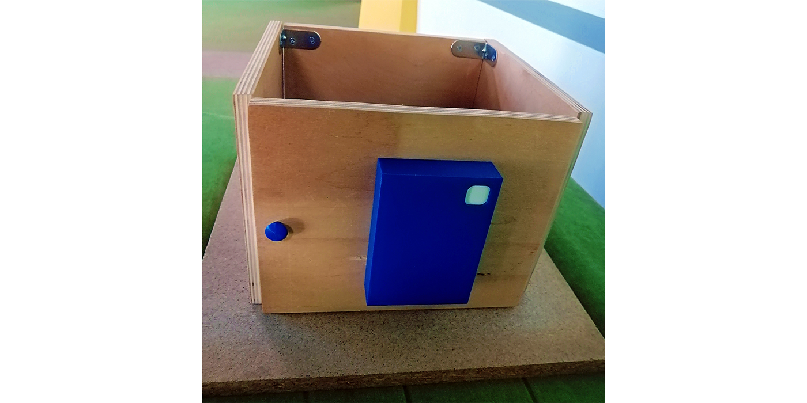

# Arduino-based Locking System

> **Opens with RFID tags and Bluetooth signal via Android app. It has sound and
LED notifications. It is automatically closed thanks to the reed switch, which
> is activated by the counter bar of the lock with a magnet. The case and some
> components of the system were printed on a
3D-printer. Prototype:**

## Components:

- Arduino Nano
- Expansion Board
- Bluetooth HC–06
- RFID RC522
- Servo Tower Pro MG996R 180
- Reed Switch
- RGB LED
- Buzzer

## Photos

> ### The interior of the locking system
> 

> ### Details of the outer and inner parts of the case
> 

> ### Locking mechanism based on servo
> 

> ### Closed / Open
> 
